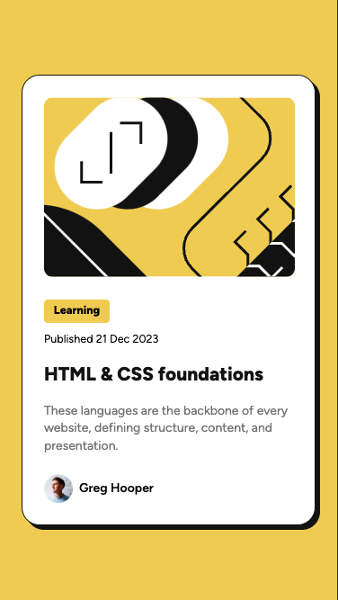

# Frontend Mentor - Blog preview card solution

This is a solution to the [Blog preview card challenge on Frontend Mentor](https://www.frontendmentor.io/challenges/blog-preview-card-ckPaj01IcS). Frontend Mentor challenges help you improve your coding skills by building realistic projects. 

## Table of contents

- [Overview](#overview)
  - [The challenge](#the-challenge)
  - [Screenshot](#screenshot)
  - [Links](#links)
- [My process](#my-process)
  - [Built with](#built-with)
  - [Useful resources](#useful-resources)
- [Author](#author)

## Overview

### The challenge

Users should be able to:

- See hover and focus states for all interactive elements on the page

### Screenshot

### Links

- Solution URL: [FrontendMentor solution page](https://www.frontendmentor.io/solutions/blog-preview-card-solution-USIriurPw7)
- Live Site URL: [GitHub Pages](https://edmarpaulino.github.io/frontend-mentor-blog-preview-card-solution/)

## My process

### Built with

- Semantic HTML5 markup
- CSS custom properties
- Flexbox

### Useful resources

- [HTML Semantics Cheat Sheet](https://learntheweb.courses/topics/html-semantics-cheat-sheet/) - This helped me with semantics.
- [How to animate box shadow](https://tobiasahlin.com/blog/how-to-animate-box-shadow/) - This helped me with box shadow animation.

## Author

- Frontend Mentor - [@edmarpaulino](https://www.frontendmentor.io/profile/edmarpaulino)